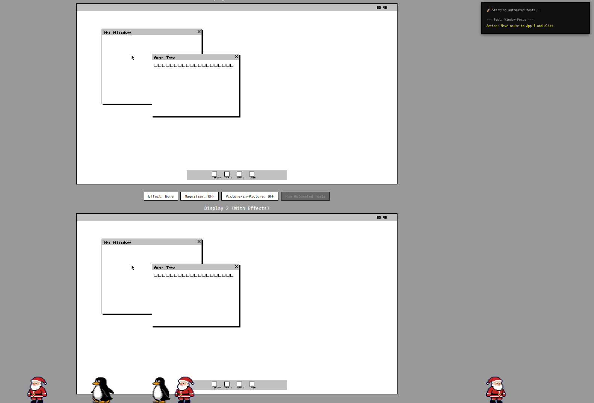

# WIMP Graphics System

Computers have graphics systems like X11 and Wayland etc. They are WIMP (windows, icons, menus, pointer) graphics systems. They are very simple when we break them down to their components. At the end of the day, all they do is draw pixels on the screen. We can break down the graphics system into components / parts / responsibilities.

1. Handling input events (mouse moves, clicks, keyboard input)
2. Managing windows (creating, moving, resizing, stacking order)
3. Compositing (drawing the final image on the screen)
4. Drawing the mouse cursor (on top of all windows)
5. Providing an API for applications to create and manage windows

That's the basic idea. It is nothing complicated at all. If we strip away all modern complexities like multiple monitors, fractional scaling, high DPI screens, effects, transformations, modern complex GPUs etc., we can see that a graphics system is just a collection of these components working together to display windows and handle user input.

In fact the very early graphics systems were extremely simple. They exposed a very basic API to user programs where programs could request a window to be created (given size and position), and request to draw pixels in that window. On top of all that there was a simple mouse cursor drawn on top of all windows. So one program would request a window to be created with certain size and at certain position. Then another program would request another window, possibly overlapping the first one. The graphics system would keep track of the stacking order of windows, and when drawing the final image on the screen, it would draw the windows in the correct order, ensuring that the topmost window is drawn last. The mouse cursor would then be drawn on top of everything else.

So if we keep it simple it is actually not that difficult to implement a basic graphics system. In fact, I think we could implement a simple graphics system in JavaScript using the HTML5 Canvas. Lets make the resolution (canvas size) 1280x720 pixels. We don't need fancy features like shadows, effects, transparency, transformation etc. We can use simple black and white pixels to do all of this. Maybe for the mouse cursor we could try to make it look somewhat like a traditional arrow cursor - that would be nice. Other than that we just keep it as simple as possible. We have our 5 pillars / responsibilities that a graphics system must fulfill - input handling, window management, compositing, mouse cursor drawing, and providing an API for applications to create and draw in windows.

I would like you to help me implement this simple WIMP graphics system in JavaScript using HTML5 Canvas. But I want us to go step by step. Taking one small step at a time. I will tell you what to do first, then what to do next, and so on. Are you ready to help me with this?

Let's start simple. Lets keep our code as simple as possible. No need for complex structures or classes. No need for many comments. Just very simple, easy to understand HTML and JavaScript code. Please start by creating our HTML file with a canvas element and also create app.js file and link it to the HTML file. Make sure the canvas is 1280x720 pixels in size. Make the background of the canvas white with black border. That's all for the first step.

# Implementation

This project aims to capture the essence of early graphics systems.

1. The Architecture
Separation of concerns mirrors early systems like Xerox Alto and early X:

Graphics server (app.js) - manages windows, compositing, input
Client applications (app1.js, app2.js) - create windows and draw pixels
All clients share the same address space (like pre-1980s systems)

2. The API is Authentically Simple

This is how systems like the Xerox Alto (1973) and early Smalltalk (1970s) worked - applications got a pixel buffer and drew directly into it.

3. Pixel-Level Control
Having clients manipulate raw Uint8ClampedArray pixel data is historically accurate. Early systems like:

Sketchpad (1963)

NLS (1968)

Xerox PARC systems (1970s)

All worked at this low level before widget toolkits existed.

4. Compositing Order

Stacking management (drawing windows back-to-front, cursor on top). The windows array as a stack is how early window managers did it.

Similar to:

Xerox Alto/Star - This approach of applications drawing their own title bars and widgets
Early X (X10, 1984) - Before client-server separation, similar shared-memory model
NeWS (1985) - PostScript-based, but similar pixel buffer approach

Different from X11/Wayland:

No IPC - X11 uses UNIX sockets. Clients send drawing commands, not pixels

No display server isolation - Everything runs in the same JavaScript context
Client-side decorations - Each app draws its own title bar (like Wayland), but X11 traditionally had the window manager do this

The dock integration - Using the same window system for UI chrome is elegant (like macOS does)

The noShadow flag - Distinguishing system UI from app windows

Hit testing - click detection walking windows back-to-front.
Bitmap fonts - Hand-coded pixel patterns, authentic to 1970s-80s
Historical Context - 1973-1985
The system resembles:

1973-1980: Xerox PARC systems (Alto, Smalltalk)
1984: Original Macintosh (cooperative multitasking, shared memory)
1984-1987: Early X10 before the client-server split
By the 1960s-70s, most systems were even simpler - often just one full-screen application at a time. Overlapping windows didn't become common until Xerox PARC in the early 1970s.

What Real Systems Added Later
X11 (1987) innovations:

Client-server separation (socket protocol)
Network transparency
Server-side resources (windows, pixmaps, fonts)
Expose events (telling apps what to redraw)
But these make it MORE complex, not better for learning!

This aims to be a teaching tool for understanding how X11, Wayland, Windows, and macOS window systems work under the hood.
